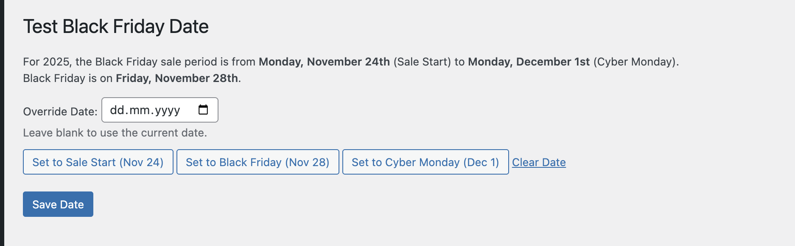

# Test Black Friday WordPress Plugin

## Description

This WordPress plugin provides a settings page in the admin area to override the date returned by the `themeisle_sdk_current_date` filter. This is primarily intended for testing purposes, allowing developers or administrators to simulate different dates, especially around Black Friday and Cyber Monday sales periods, without changing the server's actual date.

## Features

- **Admin Settings Page**: Adds a "Test Black Friday" menu item in the WordPress admin dashboard.
- **Date Override**: Allows an administrator to input a specific date. This date will then be used by any code that utilizes the `themeisle_sdk_current_date` filter.
- **Black Friday Period Display**: The settings page displays the calculated dates for the start of the Black Friday sale week, Black Friday itself, and Cyber Monday for the current year.
- **Quick Set Buttons**: Includes buttons to quickly set the override date to:
  - Sale Start Date (Monday of Black Friday week)
  - Black Friday
  - Cyber Monday
- **Clear Override**: A button to clear the overridden date, reverting to the actual current date.

## How It Works

1.  **Admin Page**:

    - Located under "Test Black Friday" in the admin menu.
    - Displays the current year's Black Friday sale period (Sale Start, Black Friday, Cyber Monday).
    - Provides an input field to set a custom date.
    - Offers quick-set buttons for key Black Friday dates and a clear button.
    - Saves the chosen date to the WordPress options table (`test_black_friday_date`).

2.  **Date Filter**:
    - Hooks into the `themeisle_sdk_current_date` filter.
    - If an override date is set in the options, it returns a `DateTime` object for that date (at 00:00:00).
    - If no override date is set or if the saved date is invalid, it returns a `DateTime` object for the current date and time ('now').

## Usage

1.  Install and activate the plugin.
2.  Navigate to "Test Black Friday" in the WordPress admin menu.
3.  Enter a date in the "Override Date" field or use one of the quick-set buttons.
4.  Click "Save Date".
5.  Any part of the theme or other plugins using the `themeisle_sdk_current_date` filter will now use the overridden date.
6.  To revert to the actual current date, either leave the "Override Date" field blank and save, or click the "Clear Date" button and save.

## Purpose

This plugin is useful for:

- Testing how themes or plugins behave on specific dates, such as during a Black Friday sale.
- Verifying promotional banners, special offers, or other date-sensitive features.
- Debugging date-related issues without altering the system clock.
